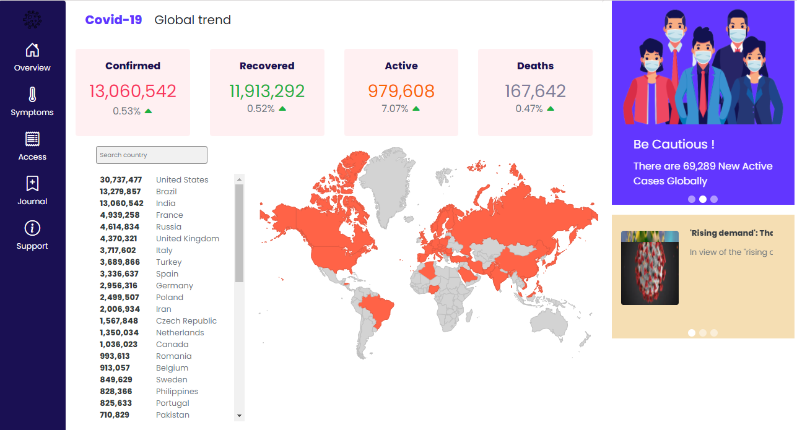

#Angular COVID-19 Tracker

##Features
1. Global Covid data
2. Search Covid cases based on country - Filter
3. Geo map
4. Covid news

##Library Used
1.angular-google-charts
2.bootstrap

##API 
Global API: https://api.apify.com/v2/key-value-stores/toDWvRj1JpTXiM8FF/records/LATEST?disableRedirect=true

Country Specific API:  https://api.apify.com/v2/key-value-stores/tVaYRsPHLjNdNBu7S/records/LATEST?disableRedirect=true 

##Output

